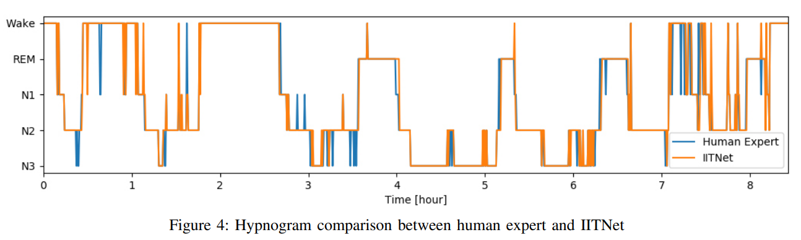

# SSD_IA3
Sleep Stage Detection study as part of the final thesis of the Master IA^3.

# Cosas que hacer
- [x] Conseguir un modelo que sea capaz de aprender algo.
- [ ] Probar con todos los datos.
- [ ] Plots que muestren las labels y las predicciones en función del tiempo.

- [ ] Matriz de transiciones entre estados.
- [ ] Probar un modelo de clasificación binaria que solo tenga que distinguir entre despierto y durmiendo.
- [ ] **Crear una pipeline donde solamente tengamos que cambiar el modelo y tocar algunas palancas.**
- [ ] **Incluir W&B en la pipeline anterior**. Esto implica decidir todas las cosas que nos gustaría trackear.

## Cosas que podría estar bien trackear en todos los experimentos
- Arquitectura
- Canales usados
- Matriz de confusión
- Plot de labels/preds en función del tiempo
- Accuracy
- ¿F1?

# Distribución de las tareas
| Tarea | Pablo | Francesco | Jorge |
|-------|-------|-----------|-------|
| Problema binario | | :heavy_check_mark: | |
| Todos los datos | :heavy_check_mark: | | |
| Visualizaciones | | | :heavy_check_mark: |